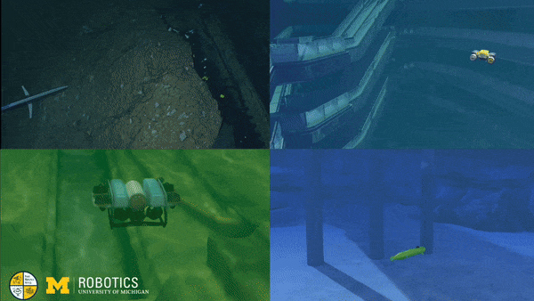
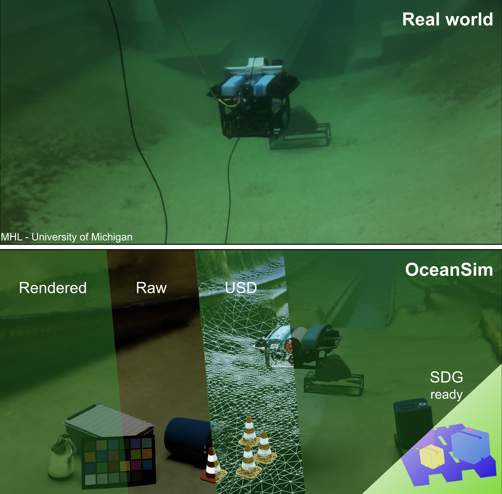

# OceanSim: A GPU-Accelerated Underwater Robot Perception Simulation Framework

<!-- website link to https://umfieldrobotics.github.io/OceanSim/ -->
<!-- arxiv https://arxiv.org/abs/2503.01074 -->
<!-- subscription form https://docs.google.com/forms/d/e/1FAIpQLSfKWMhE4L6R4jjvEw_bfMtLigXbv5WZeijDah5vk2SpQZW1hA/viewform -->
[](https://umfieldrobotics.github.io/OceanSim/)
[](https://docs.google.com/forms/d/e/1FAIpQLSfKWMhE4L6R4jjvEw_bfMtLigXbv5WZeijDah5vk2SpQZW1hA/viewform)
[](https://arxiv.org/abs/2503.01074)
[](https://docs.isaacsim.omniverse.nvidia.com/latest/index.html)
<!-- add and scale media/oceansim_demo.gif to full width-->
<!--  \ -->
<a href="https://umfieldrobotics.github.io/OceanSim/">
  
</a>

OceanSim is a high-fidelity underwater simulation framework designed to accelerate the development of robust underwater perception solutions. Leveraging GPU-accelerated rendering and advanced physics-based techniques, OceanSim accurately models both visual and acoustic sensors, significantly reducing the simulation-to-real gap.

## Highlights

<!-- GPU-accelerated, physics-based underwater sensor rendering, highly effetcive 3D workflows, open-source -->
<!-- use emoji -->
🚀 **GPU-accelerated**: OceanSim fully leverages the power of GPU-based parallel computing. OceanSim is built on top of [NVIDIA Isaac Sim](https://developer.nvidia.com/isaac/sim) and is part of [NVIDIA Omniverse](https://www.nvidia.com/en-us/omniverse/) ecosystem, which provide high performance and real-time rendering. \
🌊 **Physics-based underwater sensor rendering**: Experience realistic simulations with advanced physics models that accurately replicate underwater sensor data under varied conditions. \
🎨 **Efficient 3D workflows**: Users of OceanSim can enjoy efficient 3D workflows empowered by [OpenUSD](https://openusd.org/release/index.html). \
🤝 **Built by the community, for the community**: OceanSim is an open-source project and we invite the community to join us to keep improving it!
<!-- include figure media/oceansim_overall_framework.svg -->


## Latest Updates
- `[2025/3]` 🔥 Beta version of OceanSim is released!
- `[2025/3]` 🎉 OceanSim will be presented at [AQ²UASIM](https://sites.google.com/view/aq2uasim/home?authuser=0) at [ICRA 2025](https://2025.ieee-icra.org/)!
- `[2025/3]` OceanSim paper is available on arXiv. Check it out [here](https://arxiv.org/abs/2503.01074).

## TODO
- [x] Documentation for OceanSim provided example
- [x] Built your own digital twin documentation
- [x] Code release
- [ ] ROS integration

## Documentation
<!-- installation, running examples, building your own digital twins-->
We divide the documentation into three parts:
- [Installation](subsections/installation.md)
- [Running Examples](subsections/running_example.md)
- [Building Your Own Digital Twins with OceanSim](subsections/building_own_digital_twin.md)

## Support and Contributing
We welcome contributions and discussions from the community!
- Use [Discussions](https://github.com/umfieldrobotics/OceanSim/discussions) to share your ideas and discuss with other users.
- Report bugs or request features by opening an issue in [Issues](https://github.com/umfieldrobotics/OceanSim/issues).
- Submit a pull request if you want to contribute to the codebase. Please include the description of your changes and the motivation behind them in the pull request.

## Contributors
OceanSim is an open-source project initiated by the [Field Robotics Group](https://fieldrobotics.engin.umich.edu/) (FRoG) at the University of Michigan. We hope to build a vibrant community around OceanSim and invite contributions from researchers and developers around the world! A big shoutout to our contributors:
- [Jingyu Song](https://song-jingyu.github.io/)  
- [Haoyu Ma](https://www.linkedin.com/in/haoyuma2002814//)  
- [Onur Bagoren](https://www.obagoren.com/)  
- [Advaith V. Sethuraman](https://www.advaiths.com/)  
- [Yiting Zhang](https://sites.google.com/umich.edu/yitingzhang/)  
- [Katherine A. Skinner](https://fieldrobotics.engin.umich.edu/)


## Citation
If you find OceanSim useful in your research, please consider citing our paper:
```
@misc{song2025oceansim,
      title={OceanSim: A GPU-Accelerated Underwater Robot Perception Simulation Framework}, 
      author={Jingyu Song and Haoyu Ma and Onur Bagoren and Advaith V. Sethuraman and Yiting Zhang and Katherine A. Skinner},
      year={2025},
      eprint={2503.01074},
      archivePrefix={arXiv},
      primaryClass={cs.RO},
      url={https://arxiv.org/abs/2503.01074}, 
}
```
---

*OceanSim - A GPU-Accelerated Underwater Robot Perception Simulation Framework*

<!-- **OceanSim for Issac Sim 4.5.0**
- **Forward looking imaging sonar**.
  - Based on Omniverse replicator to achieve high performance scene query
  - Gaussian and range Rayleigh noise are added
  - Simple interface based on semantics segmentation to acheive material property configuration

**OceanSim for Issac Sim 4.2.0**
- **Sensor**
   - DVL extension: Read gt velocity, measure the distance return of four beams. Noise and uncertainty corrections are from Holoocean.
   - Next step: further characterize noise based on range readings from beam range sensor.
- **Graphics\render**  
   - Caustics example is saved in demo\usd_scenes
   - Next step: implementing slide bar tools for users to pick visually accurate underwater image formation model parameters.
- **Fossen Dynmics** 
   - Implemented the same Holoocean Torpedo AUV fossen example in Issac Sim environment. Comparsion of the simulation result is saved in demo\fossen folder. 

# Extension Install 
**4.2.0**
1. Install Omniverse launcher
2. Install Isaac Sim 4.2.0 in Omniverse Launcher
   - If you stick to Nvidia's tutorial, you can also download Omniverse Cache (managing cache) and Nucleus Navigator (managing assets). 
3. Open the software once for it to setup the environment automatically
   - To check if your Isaac Sim is installed properly, **make sure no any $${\color{red}Errors}$$ in terminals**, $${\color{orange}Warnings}$$ are fine.
4. Clone this repo to  
   - **/{path-to-your-isaac-sim}/isaac-sim-4.2.0/extsUser**
     - Mine installed defaultly on 24.04 **Ubuntu** is:  
      /home/haoyu-ma/.local/share/ov/pkg/isaac-sim-4.2.0/extsUser
5. To enable this extension, go to **Window-Extensions**, and search for **OceanSim**.  
   On the right, click the enable **switch** and **AUTOLOAD**

**4.5.0**
This version no longer needs the launcher.
After you install issac sim, you can directly skip to step 4.


# Usage
On top tool bar you can see the OceanSim menu, and hover on it you can see the contained utilities.   -->

<!-- 
In the repo, the folder **demo\usd_scenes** contains my demo scenes (.usd) and assets in proposal.   
**I haven't linked them to the UI.** But before opening it through **File-Open**, turn on the following extensions:
  - Mimic real ocean deformation
    - omni.warp.core
    - omni.warp
  - Apply forcings to collective object
    - omni.physx.forcefields
    - omni.usd.schema.forcefield

I would expect some assets linking error. I never tested on other machines.  
Let me know.  
They are exclusively implemented through blueprint, so no code body included.
-->
