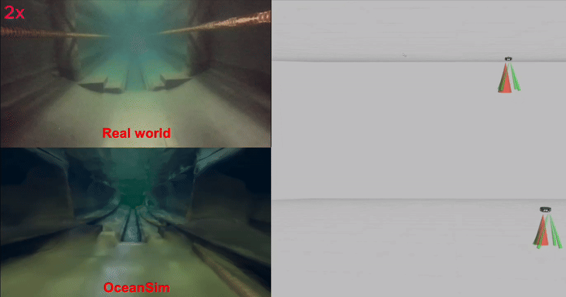

# Build Your Own Digital Twin in OceanSim
<!-- (../../media/oceansim_digital_twin.gif) -->

In this documentation, we show an example of building a digital twin for OceanSim. We hope this example can help you understand how to build your own digital twin in OceanSim.

## 3D Scan of the Environment

## Importing the 3D Scan

