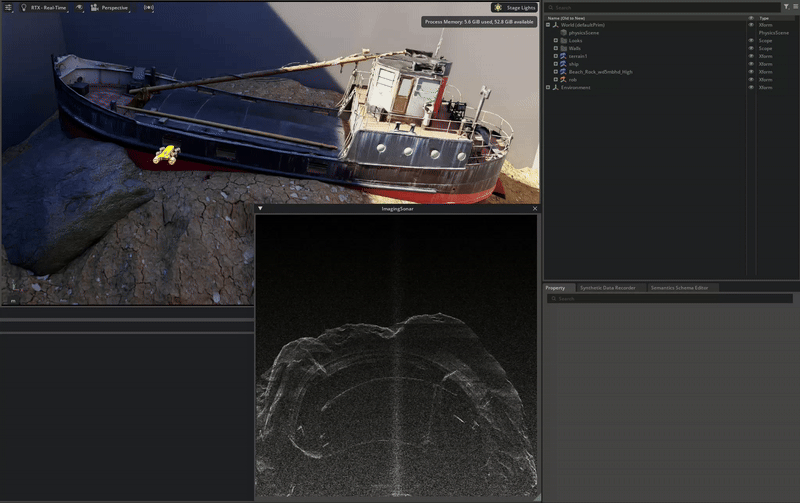

# Run SDG Examples in OceanSim
In this document, we will provide guidelines and assets folders for users to run 'UWCam_sdg_seaclear.py' in [UWCam_sdg_seaclear.py](../../standalone/UWCam_sdg_seaclear.py), which is the main standalone script used to generate our experiment dataset in paper.

## SDG Configs
We provide a bash file [run_sdg_Seaclear.sh](../../standalone/run_sdg_SeaClear.sh) to sequentially run each SDG task specified by each config json files in [Seaclear_configs](../../standalone/Seaclear_configs/) folder. Explanation for the configs are below:
**TODO**

## Assets Folder
For general computer vision tasks, we categorize assets into following three categories: environment(env_url), objects(objects_url), and distractors(distractors_folder). Users can link the corresponding assets folder downloaded from our google drive or use their own assets. Every user has different asset convention but OpenUSD has largely standardized them; however, details about how we parse the asset folder structure and generate the label can be found in [UWCam_sdg_utils.py](../../isaacsim/oceansim/utils/UWCam_sdg_utils.py)


Navigate to `OceanSim - Examples - Sensor Example` to open the module.

The module provides self-explanatory UI in which you can choose which sensor to use and corresponding data visualization will be automatically available. User may test this module in their own USD scenes otherwise a default one is used. 

We do not recommend user to perform digital twin experiment on this extension. This is an example involves boilerplate code and less performent, which is only for demonstration purpose.

For more instructions when using this example, refer to [information panel](../../isaacsim/oceansim/modules/SensorExample_python/global_variables.py) in the extension UI.

## Color Picker
OceanSim provies a handy UI tool to accelerate the process of recreating underwater column effects similar to the robot's actual working environment by selecting the appropriate image formation parameters ([Akkaynak, Derya, and Tali Treibitz. "A revised underwater image formation model"](https://ieeexplore.ieee.org/document/8578801).)

Navigate to `OceanSim - Color Picker` to open the module.

This widget allows user to visualize the rendered result in any USD scene while tunning parameters in real time. 

For more instructions when using this example, refer to [information panel](../../isaacsim/oceansim/modules/colorpicker_python/global_variables.py) in the extension UI.

## Tuning Object Reflectivity for Imaging Sonar
User can adjust reflectivity of objects in the sonar perception via adding semantic label to the object. 

Semantic type must be `"reflectivity"` as string. 
And corresponding semantic data must be float, eg. `0.2`.

Semantic configuration can either be performed by code during scene setup:
<!-- configure Prim Semantics by code -->
```bash
from isaacsim.core.utils.semantics import add_update_semantics
add_update_semantics(prim=<object_prim>,
                    type_label='reflectivity',
                    semantic_label='1.0')
```
Or with UI provided in `semantics.schema.editor` ([Semantic Schema Editor](https://docs.omniverse.nvidia.com/extensions/latest/ext_replicator/semantics_schema_editor.html) should be auto loaded as Isaac Sim starts up). 

A simple tutorial is as followed:
<!-- (../../media/semantic_editor.gif) -->


As demonstrated by this workflow, developers are freely to add more modeling parameters as a new semantic type to improve sonar fidelity.  

## Adding Water Caustics
Notice the below way of adding water caustics into the USD scene is still in exploration and thus may lead to performance issue and crash during the simulation.

To turn on rendering caustics, `Render Settings - Ray Tracing - Caustics` will be set `on`, and `Enable Caustics` in the UsdLux that supports caustics will be set `on` for the light source.

Next we assign `transparent materials` (eg. Water, glass) to any mesh surface that we wish to [deflect photons](https://developer.nvidia.com/gpugems/gpugems/part-i-natural-effects/chapter-2-rendering-water-caustics) and create caustics.

Lastly to simulate water caustics, we will deform the surface according to realistic water surface deformation.

A USD file containing the caustic settings and surface deformation powered by a Warp kernel can be found in the OceanSim assets `~\OceanSim_assets\collected_MHL\mhl_water.usd` we published. 

And the corresponding demo video is provided below:

<!-- (../../media/caustics.gif) -->


