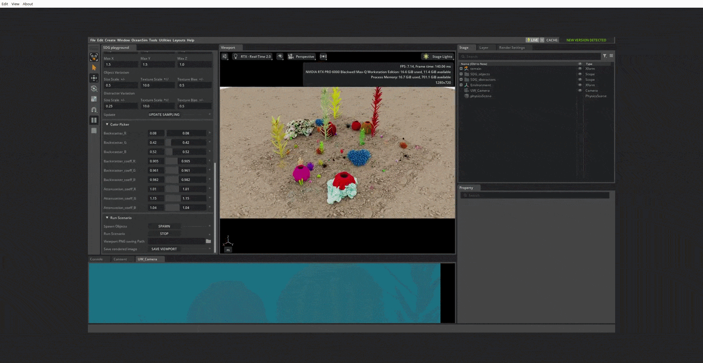

# Run SDG Examples in OceanSim
In this document, we will provide guidelines and assets folders for users to run [UWCam_sdg_seaclear.py](../../standalone/UWCam_sdg_seaclear.py), which is the main standalone script used to generate our experiment dataset in paper.

## SDG Configs
We provide a bash file [run_sdg_Seaclear.sh](../../standalone/run_sdg_SeaClear.sh) to sequentially run each SDG task specified by each config json files in [Seaclear_configs](../../standalone/Seaclear_configs/) folder. Explanation for the configs are below:

The default SDG configuration is a Python dictionary that can be overridden or replaced by JSON/YAML files passed through the `--config` command-line argument. The main options are:

- `launch_config`: Controls the Isaac Sim launch behavior.
  - `renderer`: Rendering backend to use, e.g. `RealTimePathTracing`.
  - `headless`: Runs the simulation without opening a GUI when set to `True`.
  - `extra_args`: Additional simulator arguments, such as enabling RTX 2.0/Path Tracing modes or reducing log verbosity.
- `total_captures`: Number of image sequences or samples to generate for the run.
- `camera_collider_radius`: Radius used for camera collision checks around the scene.
- `env_url`: Path to the environment asset directory used as the base scene.
- `objects_url`: Path to the object asset directory containing the target objects to place in the scene.
- `distractors_folder`: Path to the distractor asset directory used to add clutter or non-target items.
- `rt_subframes`: Number of subframes used for ray tracing rendering.
- `resolution`: Output image resolution as `[width, height]`.
- `camera_properties_kwargs`: Camera intrinsic and optical settings, including focal length, focus distance, aperture, and clipping range.
- `writers`: List of output writers. The default writer `UWCam_KittiWriter` generates KITTI-style annotations and outputs.
  - `output_dir`: Directory where generated data will be saved.
  - `colorize_instance_segmentation`: Whether instance segmentation masks should be colorized.
  - `use_tight_bbox`: Whether to use tight bounding boxes for annotations.
  - `debug_mode`: Enables extra debug output when set to `True`.
  - `UW_param`: Water and rendering parameters, including:
    - `scale_range`: Range for scaling the underwater imaging parameters.
    - `veiling`: Veiling light parameters for different water types.
    - `backscatter`: Backscatter coefficients for different water types.
    - `attenuation`: Attenuation coefficients for different water types.
- `add_distractors`: Whether to place distractor objects in the scene.
- `cam_workspace`: 3D bounding box for camera placement in world coordinates as `[minX, minY, minZ, maxX, maxY, maxZ]`.
- `cam_lookat_workspace`: Bounding box used to sample camera look-at targets.
- `obj_workspace`: Bounding box used to sample object placement positions.
- `dist_workspace`: Bounding box used to sample distractor placement positions.
- `randomize_object_color`: Whether object colors should be randomized.
- `color_bias_range`: Range used to offset object color values.
- `color_scale_range`: Range used to scale object color values.
- `disable_render_products`: Disables camera rendering between the capture when set to `True`.
- `debug_mode`: Enables additional debugging behavior for the pipeline.
- `seed`: Random seed used for reproducibility.
- `path_tracing`: Enables path tracing behavior when set to `True`.

Users can edit these values directly in the config dictionary or provide a separate JSON/YAML file to swap in a custom configuration.

## Assets Folder
For general computer vision tasks, we categorize assets into following three categories: environment(env_url), objects(objects_url), and distractors(distractors_folder). Users can link the corresponding assets folder downloaded from our google drive or use their own assets. Every user has different asset convention but OpenUSD has largely standardized them; however, details about how we parse the asset folder structure and generate the label can be found in [UWCam_sdg_utils.py](../../isaacsim/oceansim/utils/UWCam_sdg_utils.py)

## SDG playground
To help user understand and tune the above configs (because users should have distinct purpose when generating synthetic data), we encourage users to understand our functions and code their own. We developed a playground to play with and help users to understand how we perfrom randomization and manage assets for SDG. 
<!-- (../../media/SDG_playground.gif) -->

